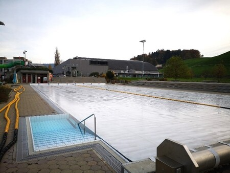
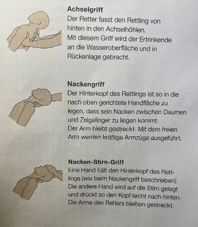
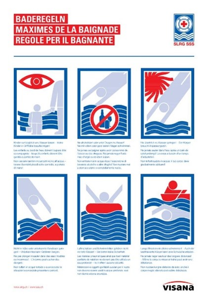
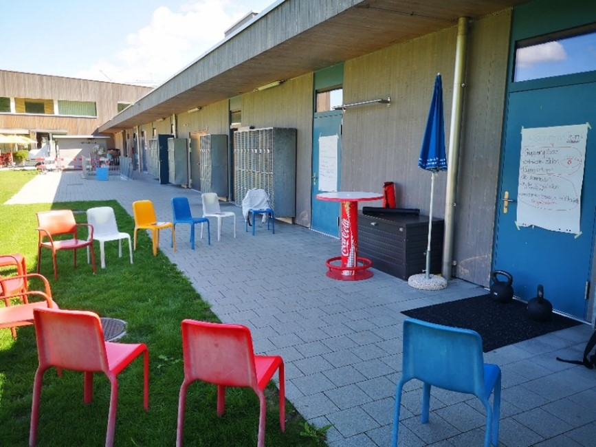

+++
title = "Reportage SLRG"
date = "2022-11-30"
draft = false
pinned = false
tags = []
image = ""
description = "Wie verhindert man Todesfälle im Wasser? Das und noch viel mehr durften wir während eines SLRG-Kurses für Rettungsschwimmer lernen."
footnotes = "In der Fusszeile können zum Beispiel Bildquellen angegeben werden. Dieser Text ist abgetrennt durch eine Linie und etwas kleiner."
+++


Wie verhindert man Todesfälle im Wasser? Das und noch viel mehr durften wir während eines SLRG-Kurses für Rettungsschwimmer lernen.



# Rettung im Wasser

Leben retten ist lernbar – Jeder Schwimmer ein Rettungsschwimmer!

Auf der ganzen Welt ertrinken täglich Menschen im Schwimmbad, im Fluss, im See und im Meer. Hier in der Schweiz haben wir das Glück, dass unsere Wassersicherheit und Unfallprävention sehr stark ausgebaut ist. Doch wer rettet ertrinkende Menschen und setzt sich für die Prävention im Umgang mit Wasser ein? Die Antwort auf diese Frage lautet: Die Schweizerische Lebensrettungs-Gesellschaft, kurz SLRG.

## Der Tag unseres SLRG-Kurses

An einem Sonntagmorgen um 8:00 treffen wir (Laurent Schenk und Léon Sermet) uns vor dem Schwimmbad Worb. Als wir herausfinden, dass sich der Treffpunkt für unseren Kurs im Innern des Bades und nicht bei der Eingangstür befindet, gehen wir ins Bad hinein. Wir werden von Barbara von Steiger begrüsst. Barbara bezeichnet sich selbst als Wasserratte. Sie ist schon lange bei der SLRG und hat sehr viel Erfahrung in ihrer Tätigkeit. Barbara ist Rettungsschwimmexpertin für Pool, Fluss und See und unterrichtet gerne Personen im Wasser. Nebenbei ist sie auch noch diplomierte Schwimminstruktorin und es ist ihr wichtig, auch jüngere Menschen für die Arbeit der SLRG zu begeistern und die Bevölkerung im Umgang mit Wasser aufzuklären. Deshalb hat sie sich dazu bereiterklärt, uns zusätzliche Informationen über die SLRG in Form eines Interviews zu geben.



Langsam treffen auch die anderen Teilnehmer*innen des Kurses ein und die Gruppe wächst. Mit uns im Kurs sind hauptsächlich Personen, welche sich mit einer Gruppe in unbewachten Schwimmbädern aufhalten möchten oder Interesse am Rettungsschwimmen zeigen. Deshalb nehmen an diesem Kurs auch die unterschiedlichsten Personen teil. Es sind jüngere und ältere Personen dabei, einige Teilnehmer sind Lehrer, andere gehen selbst noch zur Schule. Als alle anderen Teilnehmer eingetroffen sind und die Gruppe vollständig ist, beginnt Barbara den SLRG-Kurs




Die SLRG wurde bereits 1933 gegründet. Bis heute existieren in der gesamten Schweiz etwa 130 Sektionen, welche zusammen zirka 25‘000 Mitglieder aufweisen. Die SLRG ist eine eigenständige Organisation, welche aber eine gute Zusammenarbeit mit der BFU (Beratungsstelle für Unfallverhütung), dem Schweizerischen Roten Kreuz und dem ILS (International Life Saving) pflegt. Obwohl sich Mitglieder der SLRG-Sektionen freiwillig für die Wassersicherheit engagieren, benötigt die SLRG Geld, einerseits um die Angestellten der Geschäftsstellen zu entlöhnen, aber auch um Kampagnen zu finanzieren. Die SLRG kann jährlich auf einen Betriebsertrag von ca. 2.3 Millionen Schweizer Franken zurückgreifen. Dieses Geld verdient die SLRG zu 53% aus den Einnahmen ihrer Kurse. Einen Drittel des Betriebsertrages machen Spenden aus. Diese erhalten sie zu einem großen Teil von ihrem Sponsor Visana, aber auch durch viele Privatpersonen, welche der SLRG Geld spenden. Neben diesen zwei finanziellen Stützen, erhält die SLRG auch noch Geld aus Beiträgen von Nonprofit Organisationen und Erträge aus Geldern von öffentlich-rechtlichen Körperschaften (Swiss Olympic, BASPO).




## Schwimmtest und Tauchübungen:

Neben einem BLS-AED-SRC-Zertifikat (ein Kurs, der die lebensrettenden Maßnahmen aus dem Nothelfer-Kurs repetiert), muss man für die Teilnahme am Kurs auch noch eine Schwimmprüfung bestehen. Genau damit beginnen wir. In unter 5 Minuten müssen wir vier Längen, also 200 Meter schwimmen. Es kostet uns eine gewisse Überwindung ins Wasser zu steigen, denn das Wetter ist heute nicht ideal. Es ist bewölkt und kühl, zwischendurch regnet es sogar. Die Schwimmprüfung bestehen wir nach einem kurzen Aufwärmen aber trotzdem und da wir nun für den Rest des Kurses zugelassen sind, beginnen wir auch schon mit dem ersten Praxisteil, dem Tauchen. Wir beginnen mit verschiedenen Tauchübungen und Barbara erklärt uns eine geeignete Atemtechnik, um möglichst lange tauchen zu können. Barbara sagt uns: «Die allgemein bekannte Atemtechnik Hyperventilieren, ist sehr gefährlich, denn beim Hyperventilieren wird der CO2 Gehalt im Blut gesenkt und damit der Reflex, Luft zu schnappen, unterdrückt. Es kann passieren, dass man dadurch bewusstlos wird.» Zudem sollen wir vor dem Eintauchen unsere Lungen nicht komplett füllen, weil wir auf diese Weise die Luft weniger lange anhalten können. Mit Barbaras Tipps und ein bisschen Übung können wir auch diesen Teil nach 30 anstrengenden Minuten mit einer Prüfung abschliessen. Bei dieser Prüfung müssen wir 20 Meter weit tauchen und anschliessend 5 Ringe auf einer Fläche von 15 m2 einsammeln. Auch diese Prüfung bestehen zum Glück alle Teilnehmer*innen.

## Tödliche Schwimmunfälle in der Schweiz:

In der Schweiz ertrinken gemäß Statistiken der SLRG pro Jahr durchschnittlich 45 Personen. Zu einem großen Teil passieren Todesfälle in Seen und Flüssen. Einerseits sind Seen und Fließgewässer meistens unbewacht, andererseits werden sie auch sehr oft unterschätzt. Unterschätz werden die Wassertemperaturen, denn schon ab einer Temperatur von 15°C kann es schnell zu Krämpfen oder sogar Bewusstlosigkeit kommen. Andererseits werden auch Strömungen in Flüssen oder Seen häufig unterschätzt. In der Schweiz ertrinken hauptsächlich Männer. Barbara erklärt uns, dass Männer sich häufiger überschätzen und auch häufiger unter dem Konsum von Alkohol oder Drogen baden gehen. Obwohl man in den Medien immer wieder hört, dass viele Touristen oder Migranten ertrinken, machen diese nur 14% der ertrinkenden Menschen in der Schweiz aus. Meistens ertrinken Schweizer, welche die Gewässer zwar seit ihrer Kindheit kennen, sich jedoch überschätzen und sich unnötig in Gefahr bringen. Im Wasser sterben aber nicht nur Erwachsene, sondern auch Kleinkinder, aufgrund unzureichender Beaufsichtigung. Ertrinken bleibt auch im Jahr 2021 die zweithäufigste UnfallTodesursache bei Kindern. Zu den vielen tödlichen Ertrinkungsunfällen kommen noch zahlreiche Fälle von Beinahe-Ertrinken hinzu, die bei Kindern und Erwachsenen schwerwiegende Auswirkungen auf das weitere Leben haben können.


## Wie können wir eine ertrinkende Person aus dem Wasser bergen?

Nachdem wir gelernt haben, wie man zu einer Person abtauchen kann, lernen wir jetzt, wie wir den Patienten sicher an den Beckenrand transportieren können. Dafür teilt uns Barbara in Zweierteams auf. Nun spielt immer eine Person den Patienten und die andere Person den Retter. Barbara erklärt uns, welche Griffe es gibt und wann man sie anwendet. Wir erfahren, dass es unter anderem den Nacken-Stirn Griff gibt. Diesen benutzt man, falls eine Person bewusstlos ist. Wir greifen mit einer Hand unter den Nacken des Patienten und legen die andere auf seine Stirn, um den Kopf über Wasser zu halten. Damit wir vorankommen, müssen wir mit den Beinen kräftig ausschlagen. Dann gibt es noch einen Griff fürs Transportschwimmen, welchen man bei einer ansprechbaren Person anwendet. Der Patient dreht sich auf den Rücken und hält sich an den Schultern des Rettungsschwimmers fest. Der Rettungsschwimmer schwimmt in Brustlage und transportiert die verunfallte Person bis an den Beckenrand.



Bevor wir den Mittag geniessen können, kombinieren wir beide Kursteile und schliessen den Vormittag mit einer praktischen Prüfung ab. Dabei müssen wir 45 Meter schwimmen, anschliessend 5 Meter zur verunfallten Person tauchen, das Opfer 25 Meter transportieren und dabei das Zeitlimit von 2 Minuten nicht überschreiten. Da wir diesen Kursteil beide erfolgreich abschliessen, dürfen wir in unsere verdiente Mittagspause gehen.

## Rettung im Urlaub:

n der Mittagspause picknicken wir gemeinsam mit den anderen Teilnehmer*innen und lernen uns besser kennen. Während eines Gesprächs erzählt uns Barbara, wie sie bereits einmal im Urlaub in Zypern jemanden retten musste. Sie sagt: „Das Wasser wird unterschätzt, vor allem die offenen Gewässer“. Neben der Rettung ist das Erkennen eines Notfalls ein schwieriger Teil. In Zypern habe sie lange gebraucht, bis sie begriffen habe, dass die Person in Schwierigkeiten stecke. Schlussendlich sei es ihr jedoch gelungen, die Person sicher an Land zu bringen.

> "Das Wasser wird unterschätzt, vor allem die offenen Gewässer"
>
> *Barbara von Steiger, Rettungsschwimmerin*


## Aufsicht, Prävention und Fallbeispiel:

Als unsere kurze Mittagspause zu Ende ist, geht der Tag mit einem Theorieteil im Trockenen weiter. Barbara erzählt uns, was man als Aufsichtsperson am Wasser alles beachten muss. Wir sind erstaunt über wie viele Dinge, wie die Infrastruktur der Badi, die Schwimmkenntnisse, Allergien oder Krankheiten der Schüler, man sich im Voraus informieren muss. Zudem lernen wir, was alles beachtet werden muss, wenn ein Unfall im Wasser passiert. Dazu gehört z.B. die Koordination zwischen Betreuungspersonen, aber auch, dass Gaffer vom Unfall ferngehalten werden können, indem eine beistehende Person gebeten wird ein Badetuch aufzuspannen. Barbara sagt uns auch, dass die meisten Unfälle durch unnötige Missachtung der elementarsten Baderegeln entstehen. Die Regeln klingen banal: „Spring nicht in trübes Wasser, geh nicht überhitzt baden, konsumiere keine Drogen während dem Baden, lass Kleinkinder nie allein baden.“ Doch obwohl diese Baderegeln den meisten Menschen bekannt sind, werden sie oft gerade von jungen Leuten nicht beachtet. Deshalb hat die SLRG eine Kampagne für junge Erwachsene namens “[Save your Friends](https://saveyourfriends.ch/)” lanciert.







Bevor man ins Wasser springt, um einer ertrinkenden Person zu helfen, sollte man sich seinen eigenen Grenzen und Fähigkeiten bewusst sein. Barbara sagt uns ganz klar: «Begebt euch nicht selbst in Gefahr, ansonsten müssen 2 Personen gerettet werden“. Wer keine Ausbildung im Rettungsschwimmen hat, das Wasser zu kalt ist oder die ertrinkende Person wild um sich schlägt, sollte nicht ins Wasser steigen. In diesem Fall hilft man aber, indem man sofort die Polizei anruft. Zur gleichen Zeit sollte versucht werden, am Ufer auf Höhe der Person mitzulaufen, um der Polizei immer den aktuellen Standort melden zu können. Den Standort kann man der Polizei z.B. über die Koordinatenangaben der Rega-App mitteilen. Zudem sollen die weiteren Anweisungen der Polizei befolgt werden.


### Überschrift 3

Die Überschrift 3 ist nicht mehr im Menu verfügbar. Wenn man sie verwenden will, muss man in den `Markdown`-Modus wechseln und dort eine Überschrift mit drei Hastags einleiten: `### Überschrift 3`

#### Überschrift 4

Auch Überschrift 4 muss im `Markdown`-Modus erstellt werden: `#### Überschrift 4`

## Weitere Textformatierungen

Am besten einfach alle Formatierungsmöglichkeiten in der Toolbar von `Inhalt` mal ausprobieren.

### Fett und Kursiv

Natürlich gibt es auch **fett** und *kursiv*.

### Links

[So können Links angegeben werden](https://www.lernblog.org). Wenn man in den `Markdown`-Modus wechselt, sieht man auch, welcher Link hinterlegt worden ist.

### Zitate

> «Zitate können hervorgehoben werden.»
>
> *Autor mit [Link zur Quelle](https://www.lernblog.org)*

Die Quellenangabe muss *kursiv* geschrieben werden, damit sie als Fusszeile erkannt wird.

### Liste

So sieht eine Liste aus:

* Nam de isto magna dissensio est.
* Mihi, inquam, qui te id ipsum rogavi?
* Haec et tu ita posuisti, et verba vestra sunt.
* Idem fecisset Epicurus, si sententiam hanc, quae nunc Hieronymi est, coniunxisset cum Aristippi vetere sententia.

### Nummerierte Liste

Und so eine nummerierte Liste:

1. Nam de isto magna dissensio est.
2. Mihi, inquam, qui te id ipsum rogavi?
3. Haec et tu ita posuisti, et verba vestra sunt.
4. Idem fecisset Epicurus, si sententiam hanc, quae nunc Hieronymi est, coniunxisset cum Aristippi vetere sententia.

## Bilder

Bilder werden mit dem `+`-Symbol eingefügt.


**Empfehlung für Bilder**: Meist empfiehlt sich, ein Bild ganz zuoberst im `Inhalt`-Feld einzufügen. Zusätzlich sollte man dieses auch im `Bild`-Feld angeben, damit es in der Blogübersicht erscheint.

### Tipps zu Bildgrössen

Ein Richtwert für Bilder ist, dass diese wenn möglich nicht grösser als `400kb` sein sollten. Man kann sie so verkleinern, dass die Breite höchstens `1200px` gross ist. Dies ist für die meisten Bildschirme mehr als genug.

### Bildunterschrift

Wenn bei einem Bild ein `ALT TEXT` erfasst wird, so wird dieser als Bildunterschrift im Artikel angezeigt.

## Horizontale Linie

Eine Horizontale Linie kann man entweder durch ein `<hr>` einfügen oder indem man im `Markdown`-Modus drei Striche `---` einfügt. So sieht die Linie aus:

- - -

## Lead


Oft haben Artikel unterhalb des Haupttitels einen einführenden Lead, der etwas grösser dargestellt wird.


``\
Ein Lead steht zwischen zwei solchen Blöcken.\
``

## Kasten


In dieser Box können Texte, Bilder, Videos oder andere Inhalte dargestellt werden.


``\
Der Inhalt einer Box muss wie hier von zwei Blöcken umgeben werden.\
``


Wird ein Titel angegeben, so kann die Box ausgeklappt werden.

Dies eignet sich auch für längere Inhalte.


Auch Bilder können in eine Box gepackt werden.


``\
Wird ein Titel angegeben, so kann die Box ausgeklappt werden.\
``

## Video, Audio und andere Medien einbetten

Es kann auch `HTML-Code` eingefügt werden. Manchmal geht dies etwas einfacher, wenn man dazu in den `Markdown`-Modus wechselt.

Damit können zum Beispiel Filme, Audiodateien oder Karten eingebettet werden. Meist sind auf den entsprechenden Plattformen (YouTube, Vimeo, Google Maps, etc.) entsprechende Code-Ausschnitte vorbereitet, die man direkt in den Blog einfügen kann. Am besten auf der jeweiligen Plattform nach einem Knopf für `embed` oder `share` suchen.

Bei Videos ist es ideal, wenn sie sich automatisch **an die Bildschirmgrösse anpassen**. Dies geht am einfachsten mit den hinterlegten YouTube- und Vimeo-Codes:

### YouTube einbetten

Einbetten von YouTube-Videos mit dem Code: ``

(Die `video_id` steht bei jedem YouTube-Video in der Browser-URL.)



### Vimeo einbetten

Einbetten von Vimeo-Videos geht mit dem Code: ``



### Code und Code-Blöcke

Mit dem Code-Symbol `<>` können Wörter auf `diese Art` hervorgehoben werden. Dies wird zum Beispiel für Tastenkombinationen wie `ctrl+s` oder für `Programmiercode` verwendet. Auch Math-Formeln können so ausgedrückt werden: `y = mx + b`.

Für längere solche Abschnitte verwendet man am besten das Code-Block-Symbol. Damit wird ein solcher Block erstellt:

```
const sun1 = "sun" + "il";
const sun2 = "su" + "n" + "il";
sun1 === sun2;
```

## Spass haben

😀 Viel Spass mit deinem Lernblog!